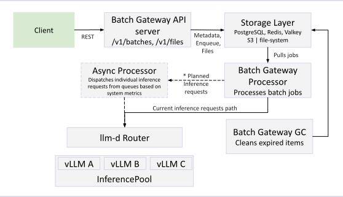

# Batch Gateway Architecture

Batch Gateway adds OpenAI-compatible batch inference processing to the llm-d stack. It sits between batch API clients and the inference gateway, managing the lifecycle of batch jobs — from job creation through request dispatching to result collection.

### API Server

The API server exposes OpenAI-compatible REST endpoints:

- `POST /v1/files` — Upload batch input files (JSONL format, up to 200 MB / 50,000 lines).
- `GET /v1/files/{id}` — Retrieve file metadata.
- `GET /v1/files/{id}/content` — Download file content (input or output).
- `DELETE /v1/files/{id}` — Delete a file.
- `POST /v1/batches` — Create a batch job referencing an uploaded input file.
- `GET /v1/batches/{id}` — Get job status, progress counts, and output file IDs.
- `POST /v1/batches/{id}/cancel` — Cancel a running job.
- `GET /v1/batches` — List batch jobs.

The API server validates input files, stores metadata in PostgreSQL (or Redis), enqueues jobs into a Redis priority queue, and stores files in S3 or a filesystem.

### Batch Processor

The processor is the core execution engine. It:

1. **Polls** the priority queue for the next job.
2. **Ingests** the input file — parses model IDs and system prompts, groups requests by model, and builds per-model execution plans written to local disk.
3. **Executes** plans concurrently — launches per-model goroutines, acquires global and per-model semaphores, sends individual inference requests to the inference gateway, and writes results to an output file.
4. **Finalizes** — uploads the output file and updates the job status.

#### Concurrency Control

The processor uses a two-level semaphore to prevent overloading the inference gateway:

- **Global concurrency** (`globalConcurrency`) — caps total in-flight requests across all models.
- **Per-model concurrency** (`perModelMaxConcurrency`) — caps in-flight requests to a single model, preventing one large-model job from starving others.

#### Crash Recovery

On startup, the processor scans for jobs that were `in_progress` when a previous instance crashed. It re-processes these jobs from the beginning, skipping requests whose results already exist in the output file. Recovery concurrency is separately capped (`recoveryMaxConcurrency`) to avoid overwhelming the system during restart storms.

### Garbage Collector

The GC runs on a configurable interval (default 30 minutes) and removes:

- Expired batch jobs (past their `completion_window`).
- Expired files (past their configured expiration).
- Orphaned output files from failed jobs.

It supports a dry-run mode for testing, and limits concurrent deletions to avoid database pressure.

## Data Layer

All three components share a pluggable data layer:

| Function | Options | Notes |
|----------|---------|-------|
| Jobs and files metadata | PostgreSQL, Redis | PostgreSQL recommended for production |
| Priority queue | Redis | Sorted set with deadline-based priority |
| Event channels | Redis | Pub/Sub for job cancellation and status |
| Status updates | Redis | Progress tracking with TTL |
| File storage | S3, Filesystem | S3 for multi-replica deployments; filesystem (PVC) for single-node |

## Authentication and Multi-Tenancy

Batch Gateway delegates authentication and authorization to the upstream gateway infrastructure:

- The API server extracts a tenant identifier from an HTTP header (configurable).
- All data queries are filtered by tenant ID — cross-tenant access returns 404.
- The processor forwards configurable headers (`passThroughHeaders`) with each inference request, so the inference gateway can authenticate and authorize the end user per-request.
- File paths are hashed by tenant ID to prevent enumeration.

The batch route authenticates (verifying identity), while the inference route authorizes (verifying model access). This separation ensures that batch job creation doesn't require per-model permissions — authorization is enforced at inference time.

## Observability

- **Prometheus metrics** — request rates, job processing times, queue wait duration, worker utilization, per-model concurrency, and token counts. ServiceMonitor and PodMonitor resources are included in the Helm chart.
- **OpenTelemetry tracing** — distributed traces across API server, processor, database, and inference gateway calls. Configurable sampling rate and OTLP endpoint.
- **Grafana dashboards** — pre-built dashboards for API server and processor metrics, included in the Helm chart.
- **Prometheus alerting rules** — configurable alerts for high queue wait time, job failure rate, expired jobs, and worker saturation.

## Related

- [Batch Gateway Guide](../../../guides/experimental/batch-gateway.md) — operator guide for deploying and configuring Batch Gateway.
- [Batch Gateway Repository](https://github.com/llm-d-incubation/batch-gateway) — source code, Helm chart, and platform-specific deployment guides.
- [Batch Gateway Design Documents](https://github.com/llm-d-incubation/batch-gateway/tree/main/docs/design) — detailed design documents.
